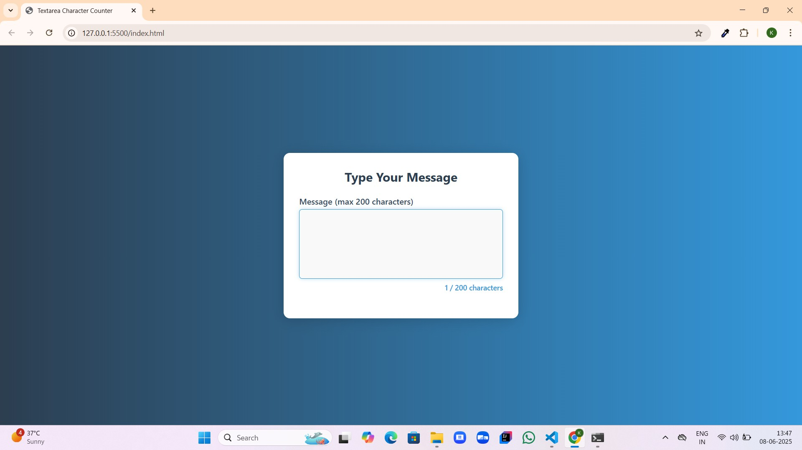
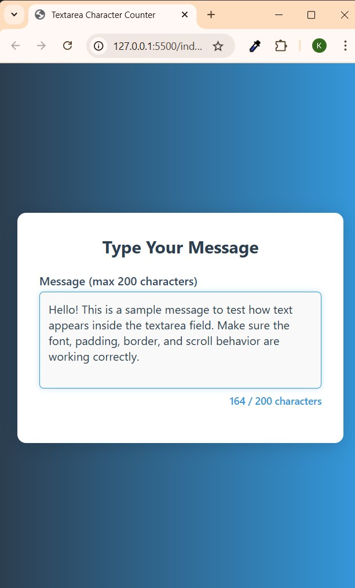

# 📝 Textarea Character Counter

*Textarea Character Counter* is a sleek and interactive message form built with *HTML, **CSS, and **JavaScript*. It allows users to type messages up to 200 characters, showing a live counter and a warning when the limit is reached.

## 🌟 Features

### ✨ Interactive UI

* Clean and modern design
* Smooth animation and styled input focus
* Real-time character counter

### ⚠ Character Limit Warning

* Displays current character count out of 200
* Warns when character limit is reached
* Prevents typing beyond the limit

### 📱 Responsive Layout

* Mobile-first design
* Adapts well to different screen sizes

## 🧰 Technologies Used

* *HTML5*
* *CSS3*
* *JavaScript*

## 📁 Folder Structure

TEXTAREA/
│
├── Screenshots/
│   ├── Homepage.jpg              # Full UI view
│   ├── Responsiveview.jpg        # Mobile view screenshot
│   └── WarningMessage.jpg        # Character limit warning display
│
├── index.html                    # HTML structure
├── script.js                     # JavaScript functionality
├── style.css                     # CSS styling
└── README.md                     # Project documentation

## 📸 Screenshots

### 🖥 Home Page

### 📱 Responsive View

### ⚠ Warning Message

## 👩‍💻 Author

*Developed by:* [Karthiga P](https://github.com/KarthigaP20)

## 🚀 Live Demo

> Coming soon… (or add your GitHub Pages/live URL here)

## 💬 Feedback

If you have ideas or find bugs, feel free to open an issue or contribute.

## 🙏 Thank You

Thank you for viewing this project!
Your feedback and support are always appreciated. 💙
Happy coding!

